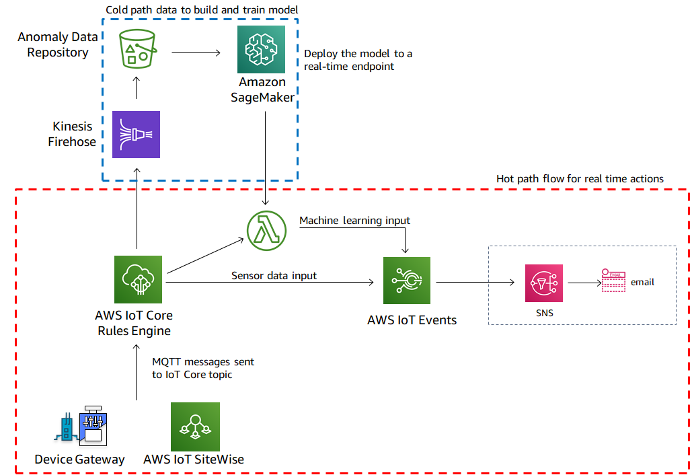

# Integrated Machine Learning with IoT Events

This AWS IoT Events code colloborates machine learning with IoT Events and supprots the blog Integrating Machine Learning with AWS IoT Events.

## Use case

AWS IoT customers manage a large number of industrial assets which send sensor data to the cloud. The smooth operation of these assets is critical to the productivity of their plants, since any equipment breakdown can lead to unexpected downtime and require expensive recovery maintenance. The ability to predict such failures and respond to them in a timely manner can help industrial users improve operational efficiency and total uptime.

* Overview of asset maintenance strategies
An effective maintenance program allows industrial companies to reduce the likelihood of equipment failure. To achieve this, a typical solution for a single asset usually requires multiple approaches to monitor the asset. Each of these approaches can be defined by the number and variety of parameters analyzed, and is referred to as the “maintenance maturity level”. Here are 3 common maturity levels that our customers consider:

* Schedule-based maintenance* refers to the maintenance performed at periodic intervals, typically defined by the original equipment manufacturer (OEM). E.g. A pump has exceeded 1000 hours of operation.
* Condition-based maintenance* refers to the maintenance performed when predefined metric thresholds are breached. These thresholds can be defined by the operator or by the OEM. E.g. Pumping temperature of the fluid exceeds 200 deg C.
* Predictive (AI-based) maintenance* refers to the maintenance activities that are triggered when there is a high likelihood of failure. The likelihood of failure can be determined using a machine learning algorithm on data coming from the sensors and other 3rd party systems, such as ERP or weather data. E.g. The probability of failure of the pump in the next 24 hours exceeds 50%.



## Design Pattern

AWS IoT components used here are IoT Core, IoT Events along with a Lambda for calling the Sagemaker for running the Machine Learning Inference. IoT Thing with a valid certificate is created which receives data using MQTT connection from a device. The data is routed to IoT Events using IoT Rules. The IoT Events has a state machine which performs a logical check on the incoming data. On Error, a SNS notification is sent to the registered subscribers. IoT Rules is also used to route data to Lambda function which calls a Sagemaker endpoint to get the prediction on likely_failure_24hrs. This prediction is posted as a batch_put_message by the lambda function for consumptions by the IoT Events State machine. 

## Folder Structure

```text
integrating_machine_learning/
├── README.md                          <-- This file!
├── cfn
│   ├── aws_iotevents_iml-INPUT.cfn.yaml <-- CloudFormation template
│   └── lambda_functions
├── docker
│   ├── certs
│   ├── Dockerfile-aws-iotevents-iml
│   ├── docker-compose.yml
│   ├── aws-iotevents-iml.sh
│   ├── simulated_motor.py
├── docs

```

There are two main components to using the accelerator. The `cfn/` directory contains the CloudFormation assets to create the IoT / Lambda components on the Cloud. The cloud deployment then waits for the target system, in this case a docker container, to start.

The `docker/` directory contains the assets to create a Docker image and running container with python scripts to send randomized device data.

## How to Deploy

To launch this, there are a few prerequisites and steps to complete. It is assumed you have basic experience with AWS IoT via the console and CLI.

The main steps for deployment are:

1. *Complete prerequisites*. Ensure there is an AWS IoT certificate and private key created and accessible locally for use.
2. *Generate and launch the CloudFormation stack*.
3. *Run the container*. Launch (`docker-compose --build up`) to build the container, which will start sending random motor data.

When finished, stopping the accelerator (`CTRL-C` followed by `docker-compose down`) will gracefully stop all containers and then remove then. The deployment state and any persisted data will be preserved in the `docker/` subdirectories, and used when restarted.

### Verify Prerequisites 

The following is a list of prerequisites to deploy the accelerator:

* AWS Cloud
  * Ensure you have an AWS user account with permissions to manage `iot`, `iotevents`, `lambda`, `cloudwatch`, `sagemaker` and other services during the deployment of the CloudFormation stack.
  * Create an AWS IoT Certificate and ensure it is activated and the certificate and private key files are saved locally. This certificate will be associated with an AWS IoT *thing* created by the CloudFormation stack. Copy the certificates *Certificate ARN*, which will be used as a parameter for the CloudFormation stack. The *Certificate ARN* will look similar to this: `arn:aws:iot:REGION:ACCOUNTNAME:cert/27b42xxxxxxx120017a`.
  * Create an S3 bucket *in the same region where CloudFormation resources will be created* to hold the packaged files. Please see [this link](https://docs.aws.amazon.com/AWSCloudFormation/latest/UserGuide/using-cfn-cli-package.html) for more details.
* Local Environment (where running the simulated motor)
  * Verify Docker Desktop or Docker Machine installed, and you have the ability to create or download images locally and run containers.
  * From the certificate creation step above, note the location of the X.509 certificate and private key registered and activated with AWS IoT.
  * Ensure a recent version of the AWS CLI is installed and a user profile with permissions mentioned above is available for use.

### Launch the CloudFormation Stack

Prior to launching the accelerator, a CloudFormation package needs to be created, and then the CloudFormation stack launched from the Template. Follow the steps below to create the package via the command line, and then launch the stack via the CLI or AWS Console.

The CloudFormation template does most of the heavy lifting. Prior to running, each *input* template needs to be processed to an *output* template that is actually used. The package process uploads the Lambda functions to the S3 bucket and creates the output template with unique references to the uploaded assets. 

To create or overwrite the templates, perform the following steps from a command line or terminal session:

1. Clone the repository and change to `cfn`.

1. Create the CloudFormation output file using the AWS CLI.  Using the commands below, you can either preset the \$AWS_PROFILE, \$REGION, and \$S3_BUCKET variables, or reference those directly via the `aws cloudformation package` command. The result of that command will be an *OUTPUT* CloudFormation template file, along with the packaged Lambda functions being copied to the S3 bucket. The `AWS_PROFILE` contains the credentials, account details, and optionally region to create the CloudFormation stack.

   Complete list of commands to create the CloudFormation template file, upload assets, and create a stack (note the changes for the `--parameter-overrides` section).
   
   ```bash
   # BASH commands (replace exports with your AWSCLI profile, region, and S3 bucket settings)
   # AWS_PROFILE contains permissions to fully create and launch the CloudFormation package and template
   export AWS_PROFILE=your-profile-here
   export REGION=us-west-2
   export S3_BUCKET=your_s3_bucket_here         # Needs to be located in same region as where the CloudFormation stack is created.
                                                
   #Setup the region is aws configure to be the same as the one set above. This can be done by typing. The region here should be the same as above
   aws configure 
   and selecting the region
   
   # Create keys and certificate and save the keys and certificate arn
   aws iot create-keys-and-certificate \
     --set-as-active \
     --certificate-pem-outfile "certificate.pem" \
     --public-key-outfile "publicKey.pem" \
     --private-key-outfile "privateKey.pem"
   
   # Clean up any previously created files
   rm *-OUTPUT.yaml
   aws cloudformation package --template-file aws_iotevents_iml-INPUT.cfn.yaml --output-template-file aws_iotevents_iml-OUTPUT.yaml --s3-bucket $S3_BUCKET --profile $AWS_PROFILE --region $REGION
     
   # If using the AWS Console, upload the aws_iotevents_iml-OUTPUT.yaml and continue with the parameters.
   # Below are the steps to deploy via the command line.
     
   # To deploy back-end stack from CLI (change --stack-name and --parameter-overrides to expected values)
   aws cloudformation deploy \
     --region $REGION \
     --stack-name aws-iotevents-iml \
     --template aws_iotevents_iml-OUTPUT.yaml \
     --capabilities CAPABILITY_NAMED_IAM\
     --parameter-overrides \
     CertificateArn="certificate ARN from prerequisites"  \
     SNSEmail="email to send SNS to" \
     S3BucketName="S3 bucket name for ML" \
     ThingName="Name of Thing"
   
   # Output of stack deploy command:
   Waiting for changeset to be created..
   Waiting for stack create/update to complete
   Successfully created/updated stack - iml-iotevents-accelerator
   ```

At this point, all resources have been created.

You will get an AWS Notification - Subscription Confirmation email to the email address specified in the deployed step. Confirm the subscription if you would like nofications. 

### Configure and Launch the Docker Container

With the stack deployed, we use the certificate and private key to complete the docker deployment that simulates a device.

1. Change to the the `docker/` directory.

2. Copy over the certificate and private key files to the `certs` directory. 

3. Change the region.txt in the `certs` directory to reflect the region where the certificate was created and the cfn has been deployed.

At this point, the Docker configuration has the details needed to start the containers and create a device to connecy to AWS IoT Core using MQTT. Using `docker-compose` in the foreground, verify that the containers start and you are receiving startup log entries:

:exclamation: The first build may take a long time to complete as it installs dependencies. Further runs will use the locally created image so startup time will be shortened.

```bash
$ docker-compose up --build
Building iotcore
Step 1/9 : FROM python 2.7
...
Successfully tagged x86_64/aws-iotevents-iml-simulatedmotor:latest
Creating aws-iotevents-iml-simulatedmotor ... done
Attaching to aws-iotevents-iml-simulatedmotor
aws-iotevents-iml-simulatedmotor | Installing AWS SDK
aws-iotevents-iml-simulatedmotor | Cloning into 'aws-iot-device-sdk-python'...
```

